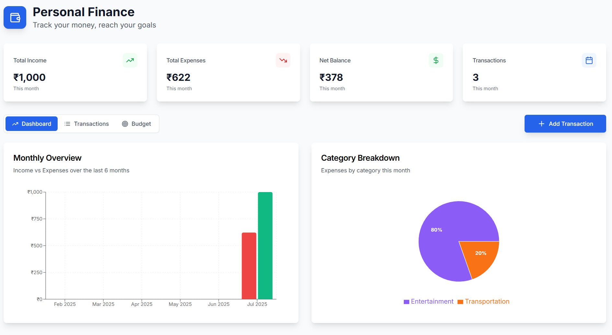
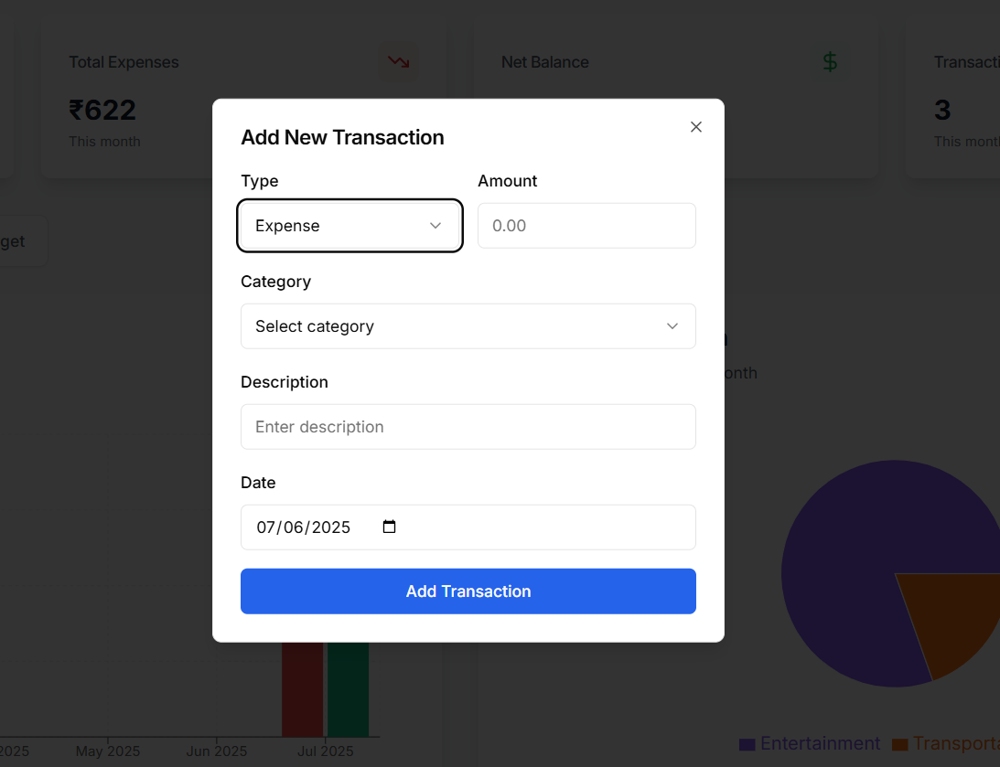
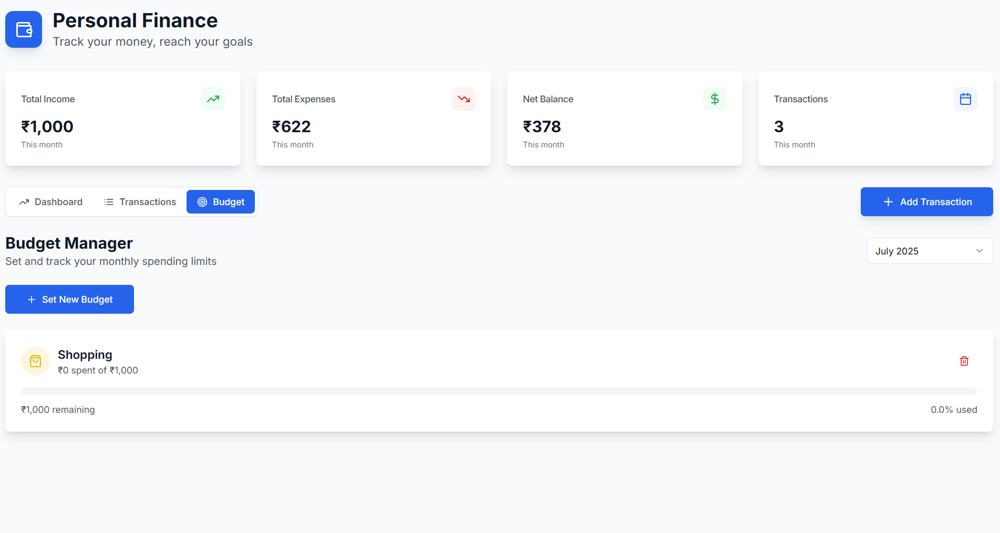
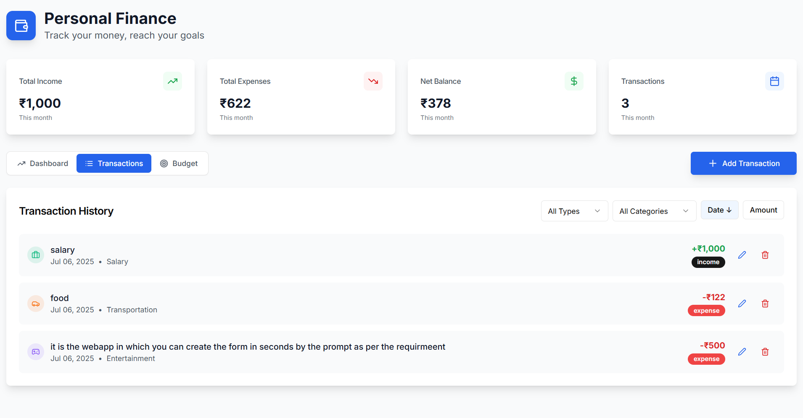

# Personal Finance Tracker


A modern, responsive, and intuitive web application for tracking personal income and expenses. Visualize your spending, set monthly budgets, and take control of your financial health with a clean, dashboard-style interface.


<!-- You can add a link to your live Vercel deployment here -->
**[Live Demo](https://personal-finance-tracker-a83i.vercel.app/)**

## ✨ Screenshots

### Dashboard Overview











## 🚀 Key Features

- **📊 Interactive Dashboard:** At-a-glance view of your finances with summary cards for total income, expenses, and net balance for the current month.
- **💸 Transaction Management:** Easily add, edit, and delete income and expense transactions.
- **📈 Data Visualization:**
  - **Monthly Overview:** A bar chart comparing income vs. expenses over the last 6 months.
  - **Category Breakdown:** A pie chart showing the distribution of expenses by category.
  - **Budget vs. Actual:** A bar chart to track your spending against your set budgets for the current month.
- **🎯 Budgeting System:** Set monthly budgets for different expense categories and monitor your spending progress with visual indicators.
- **💾 Local Data Persistence:** Your financial data is saved automatically to your browser's `localStorage`, ensuring your information is private and available across sessions.
- **🔍 Filtering & Sorting:** The transaction list can be filtered by type (income/expense) and category, and sorted by date or amount.
- **📱 Responsive Design:** A mobile-first design that works beautifully on desktops, tablets, and smartphones.

## 🛠️ Tech Stack

- **Framework:** [Next.js](https://nextjs.org/)
- **Language:** [TypeScript](https://www.typescriptlang.org/)
- **Styling:** [Tailwind CSS](https://tailwindcss.com/)
- **UI Components:** [shadcn/ui](https://ui.shadcn.com/) (built on Radix UI)
- **Charting:** [Recharts](https://recharts.org/)
- **Form Management:** [React Hook Form](https://react-hook-form.com/)
- **Icons:** [Lucide React](https://lucide.dev/)

## ⚙️ Getting Started

To get a local copy up and running, follow these simple steps.

### Prerequisites

- [Node.js](https://nodejs.org/) (version 18.x or higher recommended)
- [npm](https://www.npmjs.com/get-npm) or [yarn](https://classic.yarnpkg.com/en/docs/install/)

### Installation

1.  **Clone the repository:**
    ```sh
    git clone https://github.com/Jayesh-2404/Personal-Finance-Tracker.git
    ```
2.  **Navigate to the project directory:**
    ```sh
    cd Personal-Finance-Tracker
    ```
3.  **Install NPM packages:**
    ```sh
    npm install
    ```
4.  **Run the development server:**
    ```sh
    npm run dev
    ```

